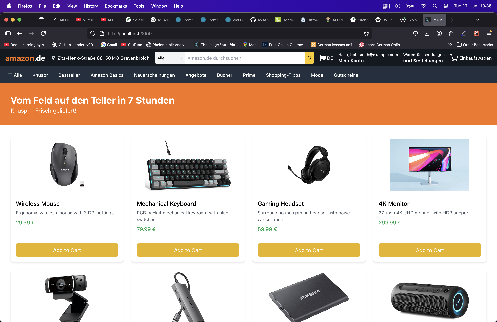

# E-Commerce Platform (React + GraphQL + PostgreSQL)

A modern e-commerce platform inspired by Amazon, built with:

- **Backend**: Node.js + GraphQL + PostgreSQL
- **Frontend**: React + Apollo Client + Tailwind CSS

---

## 🖼️ Preview



## 🚀 Project Structure

```
ecommerce-website/
├── backend/                  # Node.js + GraphQL backend
│   ├── package.json
│   ├── index.js              # Apollo Server setup
│   ├── schema/               # GraphQL typeDefs & resolvers
│   ├── db/                   # PostgreSQL connection
│   └── ...
├── frontend/                 # React frontend
│   ├── public/
│   ├── src/
│   │   ├── components/
│   │   │   └── ProductList/  # Product list feature
│   │   ├── graphql/          # Queries & mutations
│   │   ├── App.jsx
│   │   ├── index.js
│   │   └── ...
│   ├── tailwind.config.js
│   └── ...
└── README.md
```

---

## 🌐 Backend Setup

### 1️⃣ Start PostgreSQL and create the database

In PostgreSQL CLI or your DB client:

```sql
CREATE DATABASE ecommerce_db;
```

Create tables (example: `users`, `products`):

```sql
CREATE TABLE products (
  id SERIAL PRIMARY KEY,
  name VARCHAR(255) NOT NULL,
  description TEXT,
  price NUMERIC(10,2) NOT NULL,
  stock INT DEFAULT 0,
  image_url TEXT,
  created_at TIMESTAMP DEFAULT CURRENT_TIMESTAMP
);
```

Add sample data:

```sql
INSERT INTO products (name, description, price, stock, image_url)
VALUES ('Product 1', 'Description 1', 29.99, 10, '/images/product1.jpg');
```

### 2️⃣ Install backend dependencies

```bash
cd backend
npm install
```

### 3️⃣ Run the backend server

```bash
npm run dev
```

GraphQL API runs at:

```
http://localhost:4000/graphql
```

---

## 🎨 Frontend Setup

### 1️⃣ Install frontend dependencies

```bash
cd frontend
npm install
```

### 2️⃣ Run the React app

```bash
npm start
```

React app runs at:

```
http://localhost:3000
```

---

## 🛒 Features Implemented

✅ **Product List** page:

- Fetches products from GraphQL backend (`GET_PRODUCTS` query).
- Displays product name, price, description, and image.
- Uses **Tailwind CSS** for responsive styling.

✅ **GraphQL Integration**:

- Apollo Client connects React frontend to GraphQL backend.
- Queries in `frontend/src/graphql/`.

✅ **Backend API**:

- GraphQL schema and resolvers for `products`, `users`, `login`, `register`.

---

## 🗺️ Next Steps

- Add product detail pages (with routing)
- Implement user authentication (login/register forms)
- Build cart functionality
- Admin dashboard for managing products

---

## 💡 Tech Stack

| Layer    | Technology                                   |
| -------- | -------------------------------------------- |
| Frontend | React, Apollo Client, Tailwind CSS           |
| Backend  | Node.js, GraphQL (Apollo Server), PostgreSQL |
| Database | PostgreSQL                                   |

---

## 📢 Contribution

Feel free to fork, clone, and contribute to this project! 🚀  
Let’s build something amazing together.

---
